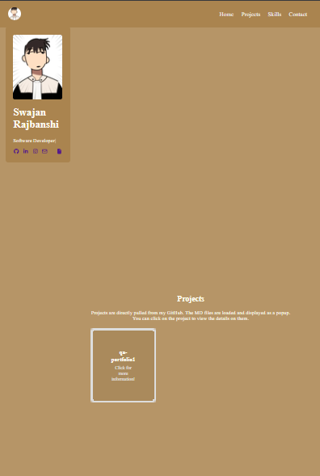

# Bug ID: BUG-002

###### Title: Fixed content overflow

###### Component: Layout

###### Environment: Firefox, Windows 11

###### Severity: Low

###### Priority: Low

###### Status: **Fixed**

**Description**:
The profile card and the site content not being displayed in the correct manner.

**Steps to Reproduce**:

1. In index.css, remove the media querry.
2. Observe the content and the profile card move to a fixed position not pre-defined.

**Expected Result**:
Page content should be displayed in a viewable manner and not in random format.

**Actual Result**:
The content was being displayed in random vertical manner where the content was reable but not the most appealing.

**Fix Applied**:
Fixed media querry for half screen, moblie screen size and smallest window size.

